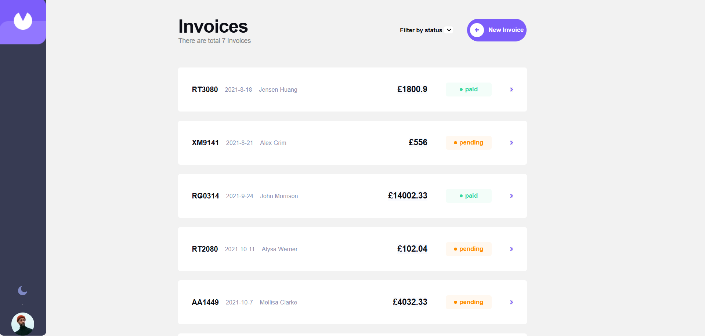
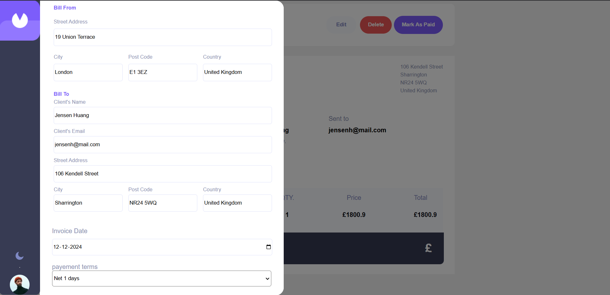
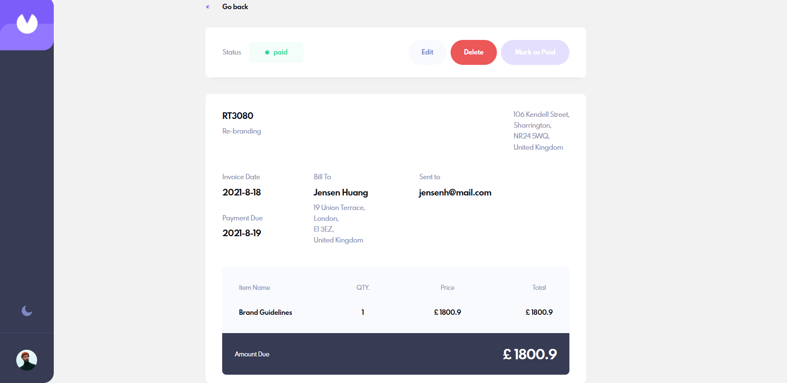

# Invoice App

A modern, feature-rich invoice management application for seamless tracking, creation, and editing of invoices.

## ✨ Features

- Developed a comprehensive invoice management application with a **dynamic popup form** to add and edit invoice details.  
- Editable status option that allows users to update invoice statuses (e.g., Paid, Pending, Draft) directly on the invoice details page for enhanced control and flexibility.  
- Created an **Items Component** inside the popup to add items with a name, price, and quantity, automatically calculating totals and updating the invoice in real-time.  
- Applied a **component-based architecture** with a focus on state management and reusability, ensuring scalable, maintainable, and performant code.  
- Utilized **React Router** to manage dynamic routing between pages, ensuring seamless navigation across different views like the dashboard, invoice details, and forms.  

---

## 📸 Screenshots

### Desktop View  
 
 
 


---

## 🚀 Live Demo

Check out the live demo: [https://invoice-app-ukdd.vercel.app/](https://invoice-app-ukdd.vercel.app/)

---

## 🛠️ Technologies Used

- **Frontend:** React.js  
- **Routing:** React Router  
- **State Management:** React hooks and Context API  
- **Styling:** CSS, Styled Components    
- **Utilities:** JavaScript for dynamic calculations  

---

## 🔧 Getting Started

To run this project locally:

1. Clone the repository:
   ```bash
   git clone https://github.com/yourusername/invoice-app.git
   npm install
   npm start


   

## 📝 What I Learned
This project helped me:

- Build reusable components, such as the **Items Component**, for dynamic forms and real-time updates.
- Enhance state management using React hooks and improve app performance.
- Implement real-time calculations for invoice items with a focus on user experience.
- Create dynamic routing using React Router for smooth navigation between pages.
- Apply best practices for maintainable and scalable component-based architecture.

---

## 🔮 Future Improvements

- Integrate a backend API for persistent data storage.
- Add authentication for secure access to user-specific invoices.
- Implement PDF export and upload features for invoices.
- Introduce dark mode for enhanced user experience.
